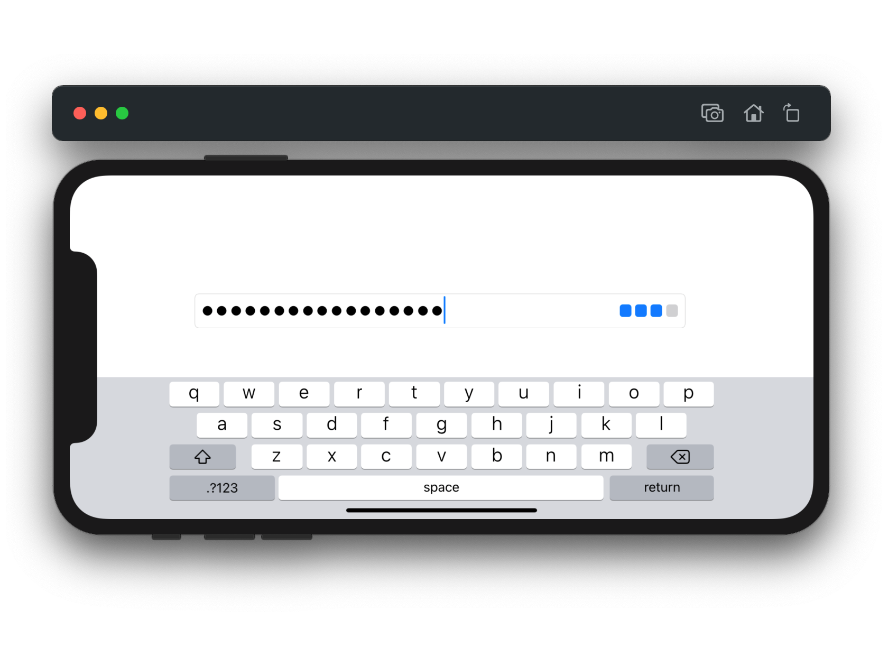

```
_________________________________________________/\/\___________________
_/\/\/\/\/\__/\/\__/\/\____/\/\/\/\__/\/\__/\/\__/\/\________/\/\/\/\___
_____/\/\______/\/\/\____/\/\________/\/\__/\/\__/\/\/\/\____/\/\__/\/\_
___/\/\________/\/\/\____/\/\__________/\/\/\____/\/\__/\/\__/\/\__/\/\_
_/\/\/\/\/\__/\/\__/\/\____/\/\/\/\______/\______/\/\/\/\____/\/\__/\/\_
________________________________________________________________________
```

`Zxcvbn` attempts to give sound password advice through pattern matching and conservative entropy calculations. It finds common passwords, common American names and surnames, common English words and common patterns like dates, repeated characters, sequences, and QWERTY patterns.

Read Dan Wheeler's  [zxcvbn: realistic password strength estimation](https://blogs.dropbox.com/tech/2012/04/zxcvbn-realistic-password-strength-estimation/) for the original author's explanation.

This implementation for [Swift Package Manager](https://swift.org/package-manager/) expands support to all Apple platforms, while carefully matching the evaluation behavior, results and functionality of its [Objective-C ancestor.](https://github.com/dropbox/zxcvbn-ios)

## Example Usage

Password evaluation is exposed as a function of `String`:

```swift
import Foundation
import Zxcvbn

let result: Result = "coRrecth0rseba++ery9.23.2007staple$".zxcvbn()
print(result.score) // strong
```

Optionally, penalize context-specific strings, like a user's name or email address, by extending the built-in dictionaries with a custom list:

```swift
import Foundation
import Zxcvbn

let result: Result = "coRrecth0rseba++ery9.23.2007staple$".zxcvbn(custom: [
    "example@aol.com",
    "example",
    "aol"
])
```

### `UIKit` Additions



When built for iOS, `Zxcvbn` includes `ResultView`, a replacement for `DBPasswordStrengthMeterView` when moving from the Objective-C implementation. `ResultView` inherits the `tintColor` of its parent and can be stretched or smooshed to fit anywhere.

```swift
import UIKit
import Zxcvbn

private let resultView: ResultView = ResultView(custom: [])
resultView.addTarget(self, action: #selector(showResultDetail), for: .touchUpInside)
resultView.tintColor = .systemTeal
resultView.result = "coRrecth0rseba++ery9.23.2007staple$".zxcvbn()
```

Additionally, `Zxcvbn` adds a `UITextField` factory that pre-configures a `ResultView` to live-update as the text value changes (pictured above). Add password evaluation to an existing password text field, even custom subclasses, in as little as two lines of code: 

```swift
import UIKit
import Zxcvbn

let textField: CustomTextField = .zxcvbn()
textField.isSecureTextEntry = true
```

## Requirements

Targets [iOS](https://developer.apple.com/ios)/[iPadOS](https://developer.apple.com/ipad)/[tvOS ](https://developer.apple.com/tvos) 13, as well as [watchOS](https://developer.apple.com/watchos) 6 and [macOS](https://developer.apple.com/macos) 10.15. Written in [Swift](https://developer.apple.com/documentation/swift) 5.3 and requires [Xcode](https://developer.apple.com/xcode) 12 or newer to build. Command-line interface depends on [Swift Argument Parser.](https://github.com/apple/swift-argument-parser)

## Acknowledgments

Ported from the Dropbox [Objective-C implementation](https://github.com/dropbox/zxcvbn-ios) by [Leah Culver.](https://github.com/leah)
