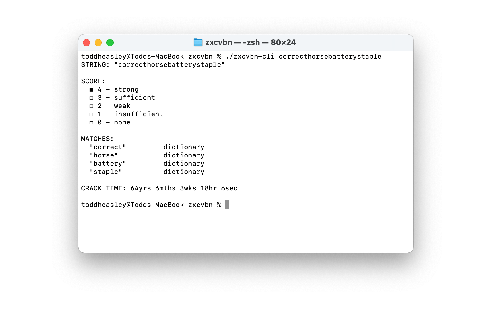

```
_________________________________________________/\/\___________________
_/\/\/\/\/\__/\/\__/\/\____/\/\/\/\__/\/\__/\/\__/\/\________/\/\/\/\___
_____/\/\______/\/\/\____/\/\________/\/\__/\/\__/\/\/\/\____/\/\__/\/\_
___/\/\________/\/\/\____/\/\__________/\/\/\____/\/\__/\/\__/\/\__/\/\_
_/\/\/\/\/\__/\/\__/\/\____/\/\/\/\______/\______/\/\/\/\____/\/\__/\/\_
________________________________________________________________________
```

`Zxcvbn` attempts to give sound password advice through pattern matching and conservative entropy calculations. It finds common passwords, common American names and surnames, common English words and common patterns like dates, repeated characters, sequences, and QWERTY patterns.

Read Dan Wheeler's  [zxcvbn: realistic password strength estimation](https://blogs.dropbox.com/tech/2012/04/zxcvbn-realistic-password-strength-estimation/) for the original author's explanation.

This implementation for [Swift Package Manager](https://swift.org/package-manager/) expands support to all Apple platforms, while carefully matching the evaluation behavior, results and functionality of its [Objective-C ancestor.](https://github.com/dropbox/zxcvbn-ios)

## Requirements

Targets [iOS](https://developer.apple.com/ios)/[iPadOS](https://developer.apple.com/ipad)/[tvOS ](https://developer.apple.com/tvos) 13, as well as [watchOS](https://developer.apple.com/watchos) 6 and [macOS](https://developer.apple.com/macos) 10.15. Written in [Swift](https://developer.apple.com/documentation/swift) 5.3 and requires [Xcode](https://developer.apple.com/xcode) 12 or newer to build. Command-line interface depends on [Swift Argument Parser.](https://github.com/apple/swift-argument-parser)

## Command-Line Interface

Included in the package



## Example Usage

Password evaluation is exposed as a function of `String`:

```swift
import Foundation
import Zxcvbn

let result: Result = "coRrecth0rseba++ery9.23.2007staple$".zxcvbn()
print(result.score) // strong
```

Optionally, penalize context-specific strings, like a user's name or email address, by extending the built-in dictionaries with a custom list:

```swift
import Foundation
import Zxcvbn

let result: Result = "coRrecth0rseba++ery9.23.2007staple$".zxcvbn(custom: [
    "example@aol.com",
    "example",
    "aol"
])
```

## `SwiftUI` Support


`Zxcvbn` includes `ResultView`, a [SwiftUI](https://developer.apple.com/documentation/swiftui) replacement for `DBPasswordStrengthMeterView` when moving from the Objective-C implementation. 

```swift
import SwiftUI
import Zxcvbn

struct ContentView: View {
    @State private var text: String = ""
    
    var body: some View {
        SecureField("Password", text: $text)
            .textFieldStyle(RoundedBorderTextFieldStyle())
            .overlay(ResultView(text), alignment: .trailing)
    }
}
```

## Acknowledgments

Ported from the Dropbox [Objective-C implementation](https://github.com/dropbox/zxcvbn-ios) by [Leah Culver.](https://github.com/leah)
